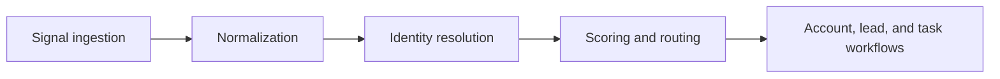

# Open GTM Signal Orchestrator

[](https://github.com/Mohit4022-cloud/GTM-Signal-Orchestrator/actions/workflows/ci.yml)
[](./LICENSE)

Open-source GTM engineering workspace for ingesting buyer signals, scoring accounts, routing leads, and powering operator workflows.

## Why This Project Exists

Revenue teams lose momentum when intent data, product signals, ownership logic, and operator follow-up live in separate systems. Open GTM Signal Orchestrator pulls those workflows into a single local-first workspace so GTM engineers and revenue teams can inspect signal flow, model routing decisions, and build against stable data contracts.

This repo is designed to be useful in two ways:

- as a practical open-source foundation for GTM engineering experiments and internal tooling
- as a portfolio-grade reference for deterministic signal ingestion, account scoring, and operator workflow orchestration

## Who It Is For

- GTM engineers building signal activation layers
- RevOps and Sales Ops teams modeling routing and SLA workflows
- Marketing Ops teams exploring account readiness and intent scoring
- engineers who want a local-first demo system with realistic GTM data contracts

## What Works Today

- deterministic seeded GTM workspace backed by Prisma and SQLite
- typed server-side contracts for dashboard, accounts list, and account detail views
- deterministic account and lead scoring with persisted score snapshots, score history, and reason codes
- implemented operator views for `/dashboard`, `/accounts`, and `/accounts/[id]`
- signal ingestion APIs at `/api/signals` and `/api/signals/upload`
- optional provider-agnostic AI assist APIs for account summaries and lead action notes with deterministic fallback output
- realistic demo data for accounts, contacts, leads, routing decisions, tasks, signal timelines, score history, and audit logs
- offline-first local development with no external services required

## Core Workflows And Architecture

The current foundation centers on deterministic backend contracts and realistic data flow.



### Current foundations

- Next.js App Router for the workspace shell and route structure
- Prisma 7 with SQLite for local-first data modeling and query helpers
- deterministic seed scripts and contract verification scripts for reproducible demos
- stable frontend-facing contract functions:
  - `getDashboardSummary()`
  - `getHotAccounts()`
  - `getRecentSignals()`
  - `getAccounts(filters?)`
  - `getAccountById(id)`
- AI assist contracts:
  - `generateAccountSummary(accountId, options?)`
  - `generateActionNote(leadId, options?)`
- scoring-specific backend contracts:
  - `getAccountScoreBreakdown(accountId)`
  - `getLeadScoreBreakdown(leadId)`
  - `getScoreHistoryForEntity(entityType, entityId, opts?)`
  - `recomputeAccountScore(accountId, trigger?)`
  - `recomputeLeadScore(leadId, trigger?)`
  - `recomputeScoresForSignal(signalId, trigger?)`

### Stack

- Next.js 16 App Router
- TypeScript
- Tailwind CSS 4
- Prisma 7
- SQLite with `better-sqlite3`
- Recharts

## Local Setup

1. Install dependencies.

   ```bash
   npm install
   ```

2. Apply the Prisma migrations.

   ```bash
   npm run db:migrate
   ```

3. Seed the local workspace.

   ```bash
   npm run db:seed
   ```

4. Start the development server.

   ```bash
   npm run dev
   ```

5. Optional: configure AI assist if you want live model output instead of deterministic fallback output.

   ```bash
   AI_PROVIDER="openai"
   OPENAI_API_KEY="your-key"
   OPENAI_MODEL="your-model"
   ```

6. Open [http://localhost:3000/dashboard](http://localhost:3000/dashboard).

### Useful scripts

- `npm run dev` for local development
- `npm run lint` for ESLint
- `npm run typecheck` for TypeScript validation
- `npm test` for the current Node test suite
- `npm run build` for a production build
- `npm run db:migrate` to apply local Prisma migrations
- `npm run db:seed` to reset demo data
- `npm run db:verify-seed` to verify deterministic seed integrity
- `npm run db:verify-contracts` to sanity-check frontend-facing contracts
- `npm run db:verify-signal-pipeline` to validate the signal ingestion workflow

## Optional AI Assist

The Phase 5 AI assist layer is read-only and grounded in the existing deterministic system state.

- `POST /api/ai/account-summary/:accountId`
- `POST /api/ai/action-note/:leadId`
- if `AI_PROVIDER=noop` or provider config is missing, both endpoints still return `200` with stable degraded contracts, deterministic fallback text, and `status="unavailable"`
- deterministic scoring, routing, task generation, SLA tracking, and audit logic remain the source of truth

## Seeded Demo Workspace

The seed is deterministic and currently creates:

- 8 users
- 20 accounts
- 40 contacts
- 30 leads
- 120+ signals
- 40 tasks
- 30 routing decisions
- persisted account and lead score history with reason codes and trigger metadata
- persisted audit logs for signal ingestion, scoring recomputes, threshold crossings, routing, and manual overrides

Useful validation paths after seeding:

- `/dashboard`
- `/accounts`
- `/accounts/acc_summitflow_finance`
- `/accounts/acc_ironpeak`

Seeded scoring stories include:

- pricing-cluster lift for `acc_summitflow_finance`
- product-usage lift for `acc_signalnest`
- inactivity decay for `acc_frontier_retail`
- urgent lead scenarios across SummitFlow, HarborPoint, and Iron Peak

## Implemented Routes And APIs

### Implemented routes

- `/dashboard`
- `/accounts`
- `/accounts/[id]`
- `/unmatched`

### Available APIs

- `POST /api/signals`
- `POST /api/signals/upload`
- `POST /api/ai/account-summary/:accountId`
- `POST /api/ai/action-note/:leadId`

### Placeholder workspace modules

- `/leads`
- `/tasks`
- `/signals`
- `/routing-simulator`
- `/settings`

## Roadmap

Planned next layers for the open-source project:

- richer unmatched queue and signal triage workflows
- deeper lead, task, and signals workspaces
- routing simulator controls and rules inspection
- configurable scoring policies
- external system adapters beyond the current mock-source model
- stronger contributor workflows and community examples

## Contributing And Community

This repo is being opened up for GTM engineers and teams who want a realistic signal orchestration foundation they can inspect, extend, and adapt.

- Start with [CONTRIBUTING.md](./CONTRIBUTING.md)
- Review the [Code of Conduct](./CODE_OF_CONDUCT.md)
- Use the [Security Policy](./SECURITY.md) for private disclosures
- Join or start product conversations in [GitHub Discussions](https://github.com/Mohit4022-cloud/GTM-Signal-Orchestrator/discussions)

## License

Released under the [MIT License](./LICENSE).
